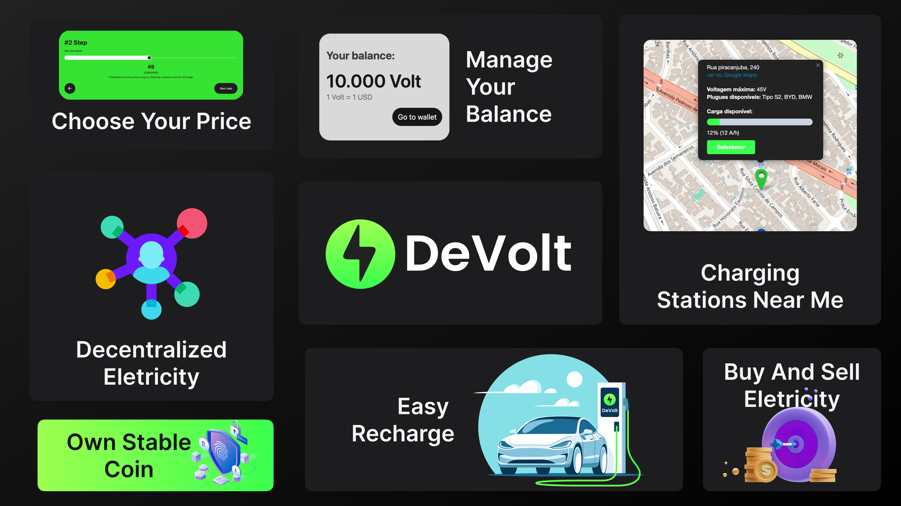
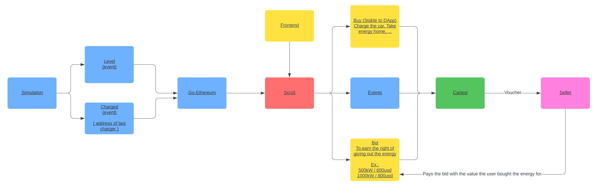

## The Problem

The current energy market is plagued by inefficiencies, lack of transparency, and limited access to direct trading mechanisms for individual producers and small enterprises. Traditional systems often result in lost potential for renewable energy sources, as excess energy cannot be efficiently distributed and utilized. Moreover, consumers face high energy costs and limited options for sustainable energy sources. The centralization of energy distribution also poses risks of monopolistic control and inhibits the broader adoption of renewable energy solutions, ultimately hindering the transition to a more sustainable and resilient energy system.

# Solution Description

DeVolt's mission is to revolutionize the energy market by focusing on the distribution of power through charging stations for electric vehicles, thereby increasing the prevalence of clean energy and furthering the decentralization of energy. By strategically placing these charging stations, DeVolt aims to enhance the accessibility and convenience of renewable energy, particularly for electric vehicle owners, promoting a shift towards more environmentally friendly transportation options. This initiative not only supports the growth of the electric vehicle market but also contributes to the reduction of carbon emissions and dependency on fossil fuels.

In pursuing this vision, DeVolt is set to transform the energy landscape, making renewable energy more readily available and affordable. This approach aligns with the global movement towards energy decentralization, allowing for a more efficient and sustainable energy usage. DeVolt's network of charging stations serves as a vital link in this ecosystem, ensuring that clean, renewable energy is a practical and preferred choice for powering electric vehicles. Through this innovative model, DeVolt is paving the way for a cleaner, greener future, where sustainable energy solutions are integrated seamlessly into everyday life, driving the advancement of both energy and transportation sectors towards a more sustainable and decentralized future.

# How is the DeVolt built?

**⁠Scroll:** Chosen for its simple integration with Layer 1 Ethereum, zero-knowledge proof alignment, and compatibility with EVM technologies.

**Scaffold ETH2 (Next.js, DaisyUI, and ShadCN):** Create a user-friendly interface on a platform that allows electric vehicle users to charge their vehicles and energy producers to market their production or surplus.

⁠**Cartesi:** Used for its optimistic rollups, ensuring true and verified computation, which also allows the use of technologies beyond Solidity, enabling work with any stack.

**⁠Foundry:** Deploys our contracts to the Scroll network, utilizing Cartesi's standard contracts for DApp interaction and our platform's token contracts.

**Golang, Kafka, HiveMQ, and MongoDB:** Represent our charging units, sending data to the blockchain every second to depict their status, charge level, usage, etc.

## Future Implementations

Looking ahead, DeVolt aims to expand its blockchain platform to integrate advanced technologies like AI and IoT, enhancing energy management and distribution efficiency. We plan to develop predictive analytics tools to forecast energy production and demand accurately, enabling more effective balancing of the energy grid. Additionally, we will explore the integration of renewable energy sources, such as solar and wind, to further diversify the energy portfolio and reduce reliance on non-renewable sources.

Another key area of focus will be the expansion of our electric vehicle (EV) charging network, facilitating broader access to clean transportation options. By increasing the number of smart charging stations, we can ensure that the infrastructure keeps pace with the growing demand for EVs, supporting a greener transportation ecosystem.

Furthermore, DeVolt is committed to fostering community-based energy projects, empowering local communities to produce, manage, and consume their own energy, thus promoting energy independence and sustainability. These future implementations will not only enhance DeVolt’s service offerings but also contribute significantly to the global shift towards a more sustainable and efficient energy landscape.

## Software Architecture

### Developers

- [Emanuele Morais](https://www.linkedin.com/in/emanuele-morais/)
- [Henrique Marlon](https://www.linkedin.com/in/henriquemarlon/)
- [Marcelo Gomes Feitoza](https://www.linkedin.com/in/marcelofeitoza7/)
- [Matheus Macedo Santos](https://www.linkedin.com/in/matheusmacedosantos/)
- [Paulo Evangelista](https://www.linkedin.com/in/paulo-evangelista/)
